# Education
---
Kasetsart University (June 2022 - March 2026) 
Bachelor of Science in Statistics, Faculty of Science 
Cumulative GPA: 3.19/4.00 (Second-Class Honors) 

---
# Skills
---
**Programming:** SQL, Python (NumPy, Pandas, PySpark) 
**Tools:** Excel, Power BI, Stata, SPSS, SAS Studio, RStudio 
**Data Analysis:** Data Cleaning, Statistical Analysis, Data Visualization 

---
# Internship Experiance
---
## Intern, Bureau of AIDS and STIs, Department of Disease Control 
- **Automating Hyperlink Creation for Healthcare Facilities** 
  *Objective* 
  Create hyperlinks in an Excel worksheet for healthcare facility websites. 
  *Description* 
  * I was assigned to create hyperlinks for healthcare facility websites in an Excel worksheet containing information for more than 10,000 healthcare facilities. Since manually creating hyperlinks for each record would have been repetitive and time-consuming, I chose to develop a VBA macro to automate the process. After running the macro, hyperlinks were automatically generated for all records, allowing users to access each healthcare facility's website directly from Excel with a single click. This reduced repetitive work and improved the efficiency of accessing healthcare facility information.
 

  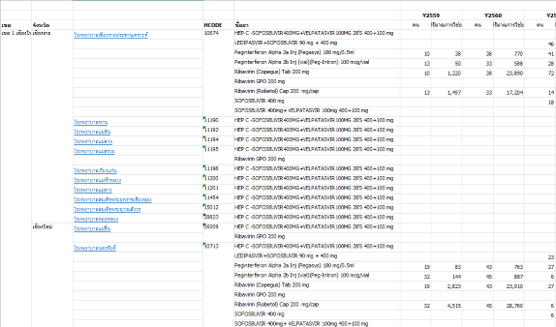 
 "Excel worksheet demonstrating automatically generated hyperlinks to healthcare facility websites using a VBA macro."

 

- **Monthly Public Health Reporting** 
  *Objective* 
  Prepare monthly public health reports using data from the organization's website. 
  *Description* 
  * I was responsible for preparing monthly public health reports using data from the organization's website. The reporting process required repeated calculations and chart creation every month. To improve efficiency, I designed an automated Excel template using formulas. After copying the monthly data into the template, the calculations and charts were generated automatically. The outputs were then used to prepare PowerPoint presentations, reducing repetitive work and improving the consistency of monthly reports.
 

  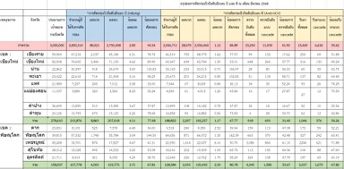 
 "Automated Excel template designed for monthly public health data processing and reporting."

 

  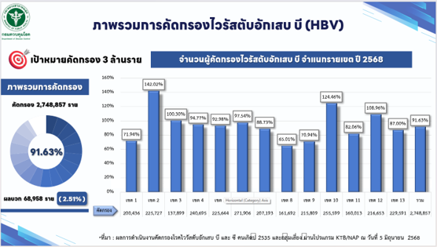 
 "PowerPoint dashboard visualizing the overall Hepatitis B virus (HBV) screening results."

 

- **Medicine Usage Trend Analysis** 
  *Objective* 
  Analyze medicine usage data to identify trends and support monthly public health reporting. 
  *Description* 
  * I was assigned to analyze medicine usage data using statistical methods. To identify relationships and trends within the data, I performed correlation and regression analyses. The analysis results were summarized and used to support monthly public health reports, providing information for data-driven reporting.
 
 

  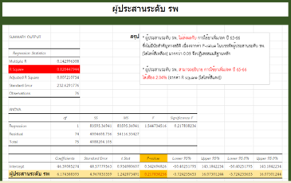 
  "Regression analysis summary output used to evaluate the statistical significance."

 

  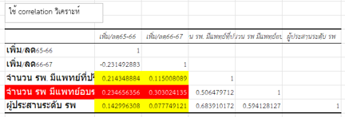 
 "Correlation matrix displaying the relationships between coordination levels and other variables."

 

  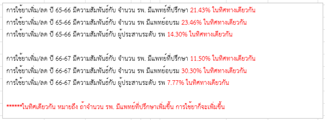 
 "Summary of the correlation analysis results, indicating the strength and direction of relationships."

 

---
# Academic Projects
---
## On the Comparison of Dimensionality Reduction Techniques for News Classification

 
- Participated in a team research project comparing dimensionality reduction techniques for fake news classification using Python.
- Developed Python code for ISOMAP and Laplacian Eigenmaps.
- Evaluated model performance using Accuracy, Precision, Recall, F1-score, and training time.
- The results showed that dimensionality reduction reduced model training time by more than 50% while maintaining similar classification performance. 

---
## The Impact of High Blood Pressure on Heart Failure Events: A Propensity Score Matching Analysis

 
- Applied Propensity Score Matching (PSM) using Stata to analyze more than 25,000 patient records.
- Evaluated the impact of high blood pressure by comparing matched treatment and control groups.
- Found that patients with high blood pressure had a 4.21% higher risk of heart failure.

  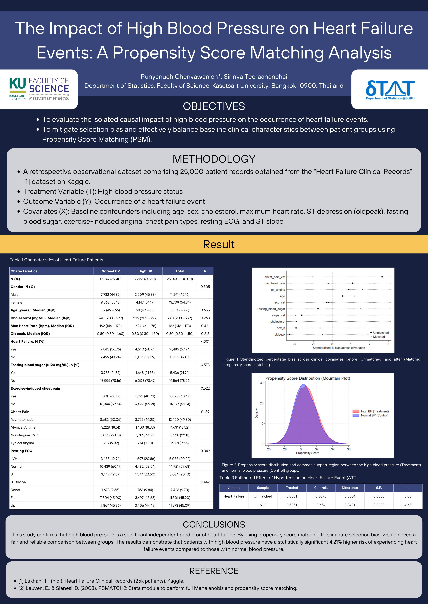

---
# Personal Project
---
## SQL

---
# Technical Certifications
---
## IT Specialist - Data Analytics 
- Issued by: Certiport | Score: 922

## Microsoft Office Specialist: Excel Associate (Excel and Excel 2019) 
- Issued by: Microsoft | Score: 850

  

---
# Certifications
---
## Data Scientist Course
- Issued by: Digital Economy Promotion Agency (depa) & Daydev Co., Ltd.   Date: November 2025  
  *Key Learnings*  
  * Efficient Programming & Code Design, Advanced Statistical & Regression Analysis, Advanced Database Systems, and Data Governance & Security. 

  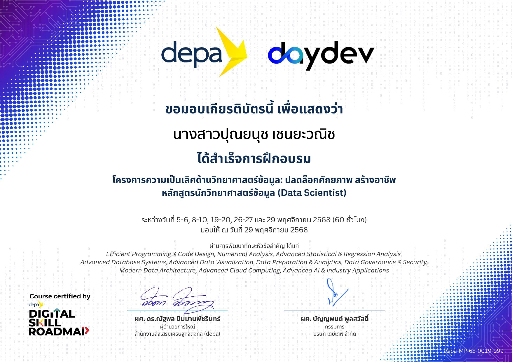

## Essential SQL for Everyone
- Issued by: BorntoDev Co., Ltd.   Date: July 2026

  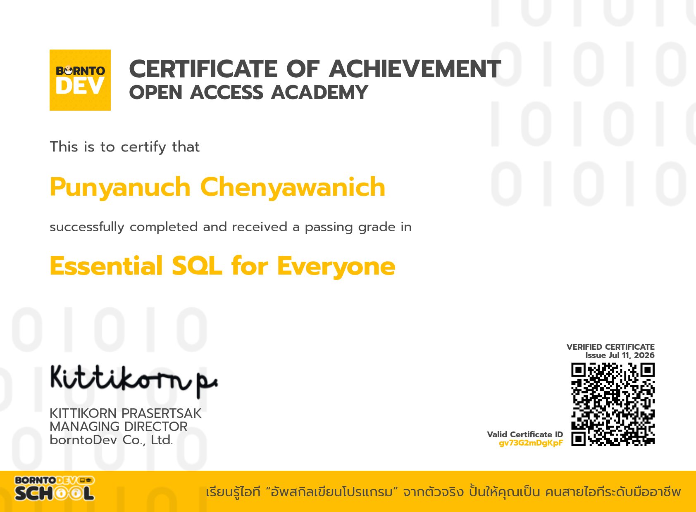

---
# Trainings & Workshops
---
## NSO DATA CAMP: Data Near You  
- Organized by: National Statistical Office (NSO) & ARIT   Date: July 18-20, 2025  
  *Key Learnings:*  
  * Learned to access and utilize the national statistical database (GD Catalog) for data analysis and real-world case studies. 
  * Applied data collaboration tools, Generative AI, and Python for data management, visualization, and interpretation. 
  * Gained essential knowledge in data security, covering cybersecurity, data privacy laws, and data ethics. 
  * Participated in the "Data Strategy for Future City" workshop, exploring data applications for financial planning and business innovation. 

  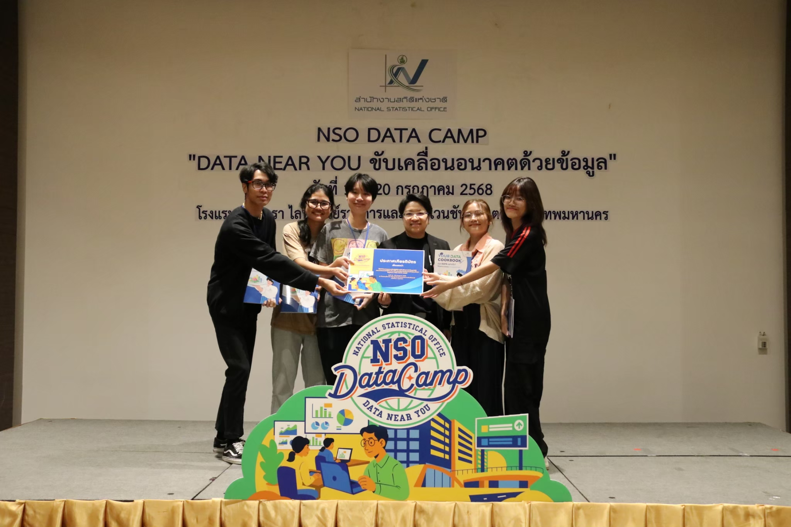 
  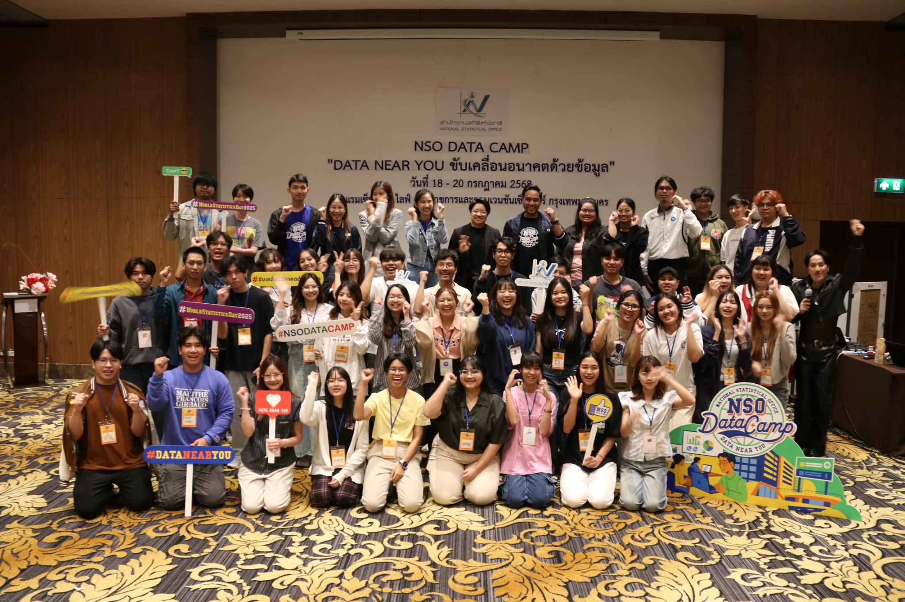

---
